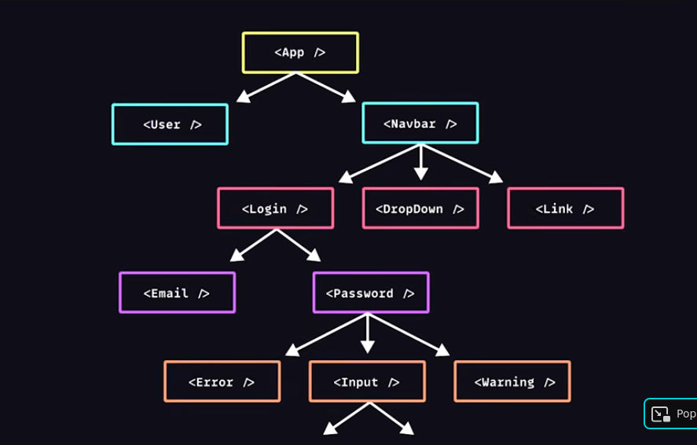

# para la prueba

- [express api](https://expressjs.com/en/api.html)
- [Effect](https://react.dev/reference/react/useEffect)
- [use reducer](https://react.dev/reference/react/useReducer)
- [use state](https://react.dev/reference/react/useState)
- [use context](https://react.dev/reference/react/useContext)

## como crear una app en react?

[Creating a React App](https://react.dev/learn/creating-a-react-app)

- [Next](https://nextjs.org/docs)
- [react router](https://reactrouter.com/start/framework/installation)
- [expo](https://expo.dev/)

### from scratch

using [vite](https://vite.dev/)

```bash
npm create vite@latest my-app -- --template react
```

https://react.dev/learn/extracting-state-logic-into-a-reducer


# redux

entonces tenemos este arbol de relaciones complejas



estos componentes comparten data del estado y si esto no es centralizado, se vuelve un pain in the ass trackiarlo

Redux es un pattern y library que nos ayuda paratener centralizado todo esto

entonces lo que hace es que se basa en un solo objeto inmutable que se llama el app state (client side database)

suscribe dispatch

el problema que tiene es que anade mucho overhead

Porfa leerse esto:

https://react.dev/learn/extracting-state-logic-into-a-reducer


## refs

https://www.youtube.com/watch?v=_shA5Xwe8_4&t=17s