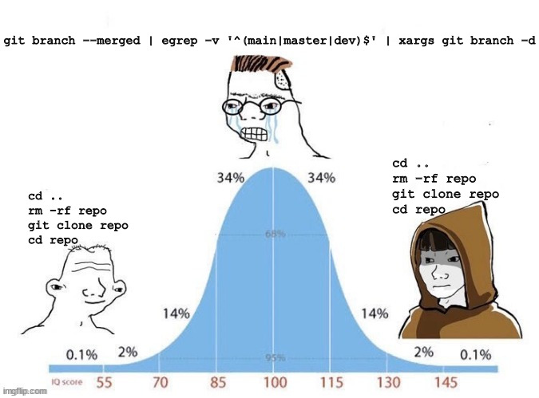

# Segunda clase =) 

Definiciones de los bordes:

https://www.w3schools.com/css/css_border.asp

## Bootstrap

https://getbootstrap.com/docs/5.3/getting-started/introduction/

https://getbootstrap.com/docs/5.3/layout/grid/

https://getbootstrap.com/docs/5.3/components/accordion/

https://getbootstrap.com/docs/5.3/components/carousel/

## git

Porque necesitamos version

- en caso de error se puede volver a versionprevia
- backup
- logging

Le entrega al desarrollo mucha versatilidad

Pero, git no es una plataforma
es osolo el programa de versionamiento


### vendors

- gitlab
  - gitlabci
  - 
- github
  - github actions
  - registry imagenes de docker
  - 
- attlasian bitbucket

### comandos
```
git status
```
```
git log
```
```
git commit
```
https://www.conventionalcommits.org/en/v1.0.0/
```
git pull
```
```
git push
```
```
git add
```

### OBVIO QUE NOS PASO



Tubimos problemas porque nos pisamos los ssh keys :) 

https://docs.github.com/en/authentication/connecting-to-github-with-ssh/generating-a-new-ssh-key-and-adding-it-to-the-ssh-agent

### git flow

https://danielkummer.github.io/git-flow-cheatsheet/


## tarea 2

- La temática es libre, puede ser una página de una tienda; sobre su serie o película favorita. (usar misma tematica de la tarea 1)
- Carousel (Imágenes a elección)
- Texto en 2 columnas, que permita demostrar que en Desktop se ve como 2 columnas y en móvil es una sola columna.
- Texto en accordion (2 colapsables)
- Generar otra rama, basada en su rama
- Agreguen tambien bootstrap
- QUe el CSS este en otro archivo
- Generen un pull request hacia su rama principal


## Como actualizar su rama
Para verificar en que rama estamos
```
git status
```
Para cambiar a su rama especifica, lest say `test`
```
git checkout test
```
pulliar del origin

```
git pull origin/main
```